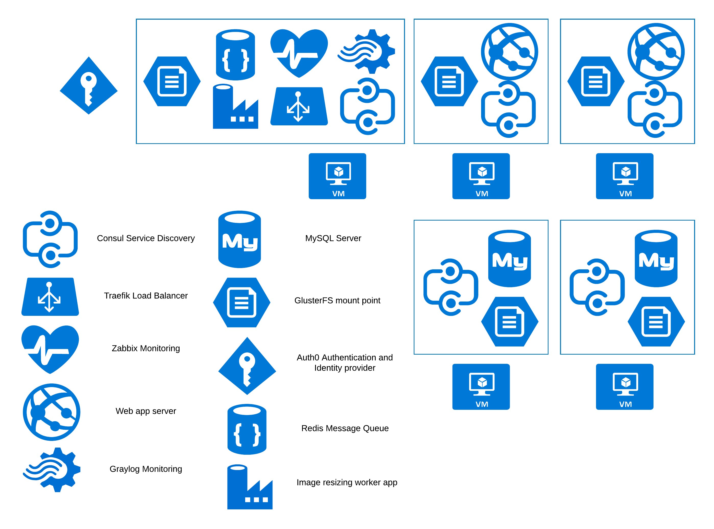
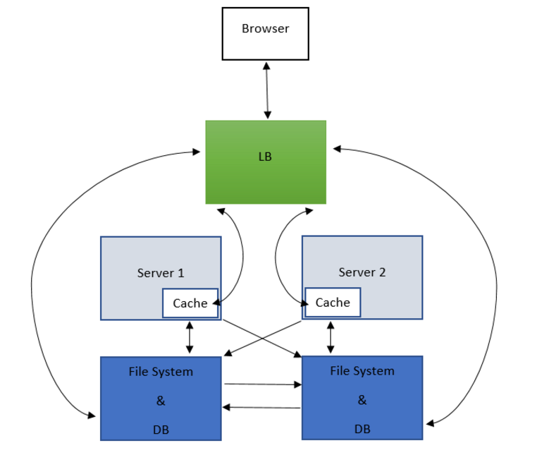

Disponibilidad
==============
Definici?n
----------
La disponibilidad es la capacidad de un sistema para estar continuamente disponible para los usuarios sin p?rdida de servicio, indicada por el porcentaje de tiempo que la aplicaci?n o servicio est?n disponible para cumplir con los requisitos del usuario. La disponibilidad es un atributo de calidad fundamental para las operaciones del negocio, especialmente en aplicaciones empresariales que no pueden dejar de atender usuarios.

La disponibilidad proporcionada por un sistema inform?tico o servicio de alojamiento se expresa con frecuencia como un acuerdo de nivel de servicio (SLA - Service Level Agreement, por sus siglas en ingl?s). Este SLA especifica el nivel de disponibilidad en porcentaje de tiempo, usualmente relativo a un mes o un a?o, que se garantiza y las penalidades que el prestador del sistema inform?tico o el servicio de alojamiento sufrir? si no se cumple el SLA, usualmente compensaci?n en cr?dito gratuito para el uso del servicio o la plataforma.

Para ejemplos de SLA ver:

 - [SLA for Virtual Machines - Microsoft Azure](https://azure.microsoft.com/en-us/support/legal/sla/virtual-machines/v1_6/)
 - [Amazon EC2 Service Level Agreement](https://aws.amazon.com/ec2/sla/)

?Con cu?les patrones se puede garantizar un SLA?
------------------------------------------------
## Failover

Se puede decir que un sistema de c?mputo implementado sobre una red soporta Failover si y s?lo si es cap?z de detectar y purgar nodos que no respondan de la red sin detener el servicio, es decir, en caso de que alguno de sus nodos falle se debe enrutar el tr?fico que originalmente fue destinado al nodo fallido a un nodo equivalente que pueda suplir el mismo servicio de manera totalmente transparente para el consumidor. 

Hay una variante de Failover igualmente popular en la que s?lamente se mantiene un s?lo nodo que presta el servicio y un nodo adicional que ?nicamente se activa en caso de que el nodo principal falle.

Es imperante tener un cluster de nodos con configuraciones de software similares para habilitar Failover en la red, dado que todos los nodos que hagan parte del esquema Failover deben ser id?nticos a la vista del consumidor del servicio que presta la red. Los nodos no tienen que tener hardware similar, aunque es recomendado para garantizar el mismo rendimiento sin importar el nodo que atienda la petici?n a la red.

El software que est? prestando el servicio debe tener ciertas consideraciones para habilitar un esquema de failover, entre las que se cuentan las siguientes:

No deben haber dependencias concretas a nodos de la red: Todos los consumos a la red que presta el servicio deben ser hechos mediante un nodo de puerta de enlace que no presta el servicio pero sabe cu?les nodos lo pueden prestar y la salud de cada uno, de tal manera que el requisito al servicio sea redireccionado transparentemente a alg?n nodo que tenga buena salud.

Los consumidores de la red no deben saber nada de esta ni asumir ning?n tipo de estado: Dado que el nodo de puerta de enlace puede redireccionar a cualquier nodo concreto de servicio los consumidores externos no pueden contar con que el nodo concreto que va atender la petici?n actual atendi? la petici?n anterior ni que atender? la siguiente. 
Concretamente, en una red que implementa Failover correctamente los nodos no pueden operar con datos ajenos al contenido del requisito que est?n procesando y a lo sumo podr?n obtener datos adicionales del servidor de base de datos, el almacenamiento com?n de archivos o la cach? distribuida compartida, logrando que los requisitos sean mayormente idempotentes.

Las redes que contengan nodos que se presten varios servicios entre s? no podr?n tener dependencias concretas entre s?. 
En otras palabras, a?n as? los servicios A y B est?n implementados en todos los nodos de la red y consuman datos uno del otro, ninguno de los nodos podr? llamar a alg?n nodo que no sea un nodo distribuidor, de otro modo, un fallo de un nodo de servicio A puede hacer cascada y hacer que el servicio B falle. 
Para facilitar estos escenarios de redes heterog?neas se suelen usar nodos con software de descubrimiento de servicios, tales como Consul (de Hashicorp), Redis u otros aplicativos basados en etcd.

Implementar Failover es la configuraci?n de alta disponibilidad m?s popular para muchos componentes de infraestructura clave, tales como servidores web, servidores de aplicaciones, servidores de bases de datos, sistemas de almacenamiento, servidor LDAP, servidores de archivos, servidores de contenido y servidores de activos multimedia

## Failback
Failback es una estrategia que se aplica cuando un nodo falla para recuperarlo y sincronizarlo con la red. Una vez que se ha diagnosticado el fallo del nodo y se han aplicado medidas correctivas se levanta el nodo de nuevo y se le sincroniza con todos los cambios que han sucedido desde el momento exacto del fallo. 

En nodos que exclusivamente presten servicios sin estado o completamente idempotentes, esta estrategia es impl?cita a la restauraci?n del nodo, dado que no maneja estado individual que sea necesario sincronizar con el estado de la red.

## Replicaci?n
Dada una red de 2 o m?s nodos que presten el mismo servicio, se dice que la red soporta replicaci?n s? y s?lo s? un cambio en los datos del nodo *k* eventualmente es realizado de manera id?ntica en todos los nodos que no son *k*, de tal manera que los datos en todos los nodos sean consistentes, al menos de manera eventual.

Hay dos estilos de replicaci?n en funci?n de la inmediatez de la operaci?n que se quiera replicar. 

Si se le da prioridad a la velocidad de respuesta se puede implementar replicaci?n as?ncrona entre todos los nodos, sacrificando consistencia permanente para ganar tiempo de respuesta. La consistencia se puede garantizar, aunque pueden existir peque?os (en un escenario ideal de transacciones ligeras) lapsos de tiempo en que el servidor *k* tenga datos nuevos, actualizados o borrados respecto a su compa?ero *k+1*. 

Un esquema de estos es llamado replicaci?n con consistencia eventual, replicaci?n as?ncrona o replicaci?n pasiva y presenta desaf?os respecto a datos que requieren respuestas autoritativas, tales como registros monetarios, de compras o de inventario, dado que un dato de este tipo requiere que cualquier nodo *k* de la red pueda responder con la misma verdad que el nodo *k+1*. 

La replicaci?n as?ncrona tambi?n puede presentar desaf?os de replicaci?n sobre datos de naturaleza incremental, tales como contadores o propiedades de alg?n objeto de negocio, dado que un esquema de consistencia eventual puede dar espacio a que tanto el nodo *k* como el nodo *k+1* tengan modificaciones relativas a un valor inicial que ambos conocen, un escenario en el que se deben implementar algoritmos de resoluci?n de conflictos. Entre los algoritmos m?s simples est?n aquellos que toman el cambio m?s reciente o la eliminaci?n del registro y descartan los dem?s, pero usualmente la resoluci?n de conflictos no puede ser implementada de manera f?cil.

Si se le da prioridad a la consistencia de datos se debe implementar un tipo de replicaci?n llamado replicaci?n s?ncrona o replicaci?n activa, tal que un cambio en el nodo *k* s?lo puede terminar (aplicar un commit a una transacci?n de base de datos, por ejemplo) si todos los nodos est?n de acuerdo y aplican el cambio al mismo tiempo. Este esquema garantiza que los datos que entrega el servicio siempre son autoritativos, aunque es bastante propenso a incrementar la latencia en las operaciones de escritura, especialmente seg?n la red del servicio escala horizontalmente dada la cantidad de nodos que deben estar de acuerdo para que una escritura se pueda realizar.

La replicaci?n as?ncrona se usa principalmente en sistemas como CDNs o bases de datos geo-distribuidas, donde se puede implementar f?cilmente resoluci?n de conflictos dando prioridad a tener los datos m?s recientes. En el caso de una base de datos particionada y geo-distribuida se puede aplicar reglas simples de resoluci?n de conflictos dando prioridad a los datos m?s frescos de otras regiones, y eliminando datos que hagan conflicto con la regi?n de cada nodo.

La replicaci?n s?ncrona se usa principalmente en escenarios donde la consistencia de escritura prima sobre cualquier otro inter?s, usualmente en escenarios financieros donde unos cuantos nodos manejan las escrituras que luego son replicadas a nodos esclavos de s?lo lectura para mantener la agilidad de lectura.

## Redundancia de Hardware
El hardware puede fallar y los data center pueden verse afectados por desastres naturales no previstos, por lo que es esencial que la infraestructura que soporta los procesos de negocio pueda tolerar fallos que no se pueden arreglar simplemente distribuyendo tr?fico a otro nodo.

### Redundancia de Hardware en cada nodo
Este criterio de redundancia aplica principalmente para el almacenamiento de datos, dado que es el componente m?s afectado por alto volumen transaccional a largo plazo. Para tolerar fallos en esta capa se utilizan t?cnicas como implementar arreglos de almacenamiento RAID de replicaci?n de datos entre varios medios de almacenamiento y aprovisionar los servidores con memoria RAM ECC que detecta y corrige errores autom?ticamente.

### Redundancia de nodos
Configurar nodos redundantes que s?lamente sean activados en caso de fallo de los nodos principales facilita la recuperaci?n sin downtime, dado que siempre hay nodos frescos sin carga listos para estos escenarios.

### Redundancia de clusters
En caso de que un cluster entero falle por errores de sincronizaci?n de nodos tener un cluster fresco completo permite la recuperaci?n con un downtime m?nimo.

### Redundancia de sitio
Finalmente, para estar listo en caso de desastre natural o alg?n otro imprevisto que impida la operaci?n del data center se puede replicar el sitio a otra ubicaci?n geogr?fica. Implementar esta t?cnica tambi?n ayuda para distribuir geogr?ficamente el tr?fico del aplicativo.

Esencialmente, la redundancia puede lograrse mediante la planificaci?n y el dimensionamiento adecuados de la infraestructura y la capacidad y al alojar m?dulos y sistemas en espera para almacenar los datos de respaldo en caso de fallo.
Una de las maneras m?s eficientes para lograr la redundancia es utilizar un dise?o "N + 1", que incorpora un nodo redundante adicional o componente para todos los componentes de hardware. El cl?ster de servidores web, el cl?ster de servidores de aplicaciones y el cl?ster de bases de datos son una sencilla implementaci?n de un dise?o N + 1.
La redundancia tiene que ser implementada a varios niveles, como la infraestructura
Nivel de componente, nivel de red, nivel de aplicaci?n, nivel de sistema, etc.

## Virtualizaci?n
Las soluciones de virtualizaci?n permiten separar la aplicaci?n del hardware y la plataforma en general sobra la que es ejecutada, con el objetivo principal de permitir la mejora de cualquiera de estos aspectos sin cambios al c?digo ni recompilaciones.

### Hardware
Virtualizar el hardware permite controlar espec?ficamente la cantidad de recursos que se le asignan a la aplicaci?n, de tal manera que varias aplicaciones (o varias instancias de la misma aplicaci?n) puedan compartir la misma m?quina f?sica sin que la carga de una afecte a la otra, por ejemplo.

### Sistema operativo
Permite ejecutar aplicaciones con diversos requisitos de sistema operativo en la misma m?quina f?sica, de manera completamente aislada y con recursos dedicados. 

### Almacenamiento
Permite que la aplicaci?n pueda tratar varios volumenes de almacenamiento de datos como uno solo, simplificando la escalabilidad de las aplicaciones sin invertir tiempo de desarrollo en distribuir la carga de archivos, dado que el sistema de archivos virtualizado lo puede hacer de manera transparente.

### Red
Virtualizar la red de comunicaciones permite conectar m?quinas de manera simple, abstrayendo la topolog?a real de red sobre la que corren las aplicaciones.

En general, la virtualizaci?n permite reconfigurar los recursos que tienen asignadas las aplicaciones sin modificaciones a la app misma, permitiendo escalar la aplicaci?n vertical u horizontalmente de manera f?cil y replicable sobre cuantas m?quinas sea necesario en todas las capas de rendimiento.

## Mantenimiento Continuo
Las actividades de mantenimiento regular de los componentes de hardware son fundamentales para mantener la infraestructura en buen estado. El mantenimiento regular aumenta la fiabilidad del hardware, garantiza operaciones fiables y prolonga la vida ?til del hardware. Las actividades de mantenimiento de hardware incluyen servicios regulares de servidores, limpieza de los componentes, realizaci?n de copias de seguridad de discos y bases de datos, actualizaci?n peri?dica del hardware

## T?cticas de Disponibilidad
### Detecci?n y aislamiento de fallos
Es importante detectar y reaccionar de manera r?pida a las anomal?as en la infraestructura y los servicios, de tal manera que estos comportamientos an?malos generen degradaci?n de servicio por el menor tiempo posible.

- Ping/Echo: Se refiere a un par de mensajes de solicitud / respuesta as?ncronos intercambiados entre nodos, usados para determinar la accesibilidad y el retardo de ida y vuelta a trav?s de la trayectoria de red asociada.

- Heartbeat: Es un mecanismo de detecci?n de fallos que emplea un intercambio peri?dico de mensajes entre un monitor del sistema y un proceso que se supervisa.

- Condition Monitoring: Implica verificar condiciones en un proceso o dispositivo, o validar suposiciones hechas durante el dise?o mediante llamados a dicho sistema o dispositivo. Esta t?ctica notifica cuando un sistema est? conectado a la red pero produce un comportamiento defectuoso. 

### Recuperaci?n de fallos:
#### Preparaci?n y Reparaci?n: 
Mecanismos para reintentar una computaci?n o introducir redundancia. 
- Active redundancy
- Passive redundancy
- Spare 
- Exception handling
- Rollback
- Software upgrade
- Retry
- Ignore Faulty behavior
- Degradation
- Reconfiguration

#### Reintroducci?n: 
Restauraci?n de los nodos despu?s de acciones correctivas.
- Shadow
- State resynchronization
- Escalating restart
- Non-stop forwarding (NSF)

#### Prevenci?n de fallos:
- Removal from service
- Transactions
- Predictive model
- Exception prevention
- Increase competence set

Escenarios de Disponibilidad
============================

La red que soporta la aplicaci?n podr? tolerar una indisponibilidad en cualquiera de sus nodos, incluyendo escalamiento vertical, siempre y cuando al menos un nodo de cada tipo permanezca disponible.

- **Fuente:** Interna, Hardware
- **Est?mulo:** Omisi?n
- **Artefacto:** Procesadores
- **Entorno:** Operaci?n sobrecargada
- **Respuesta:** Degradaci?n temporal del rendimiento del servicio
- **Medida de respuesta:** Mientras el nodo es reestablecido

Cualquiera de los servicios de la aplicaci?n podr? ser escalado horizontalmente sin downtime alguno.

- **Fuente:** Interna, Personas
- **Est?mulo:** Tiempos incorrectos (Alta latencia de respuesta)
- **Artefacto:** Procesadores
- **Entorno:** Operaci?n sobrecargada
- **Respuesta:** Degradaci?n temporal del rendimiento del servicio
- **Medida de respuesta:** Mientras el nuevo nodo se une a la red 

La red podr? sanarse a s? misma si alguno de sus nodos llegase a experimientar un fallo catastr?fico que sea recuperable con un reinicio de la m?quina virtual que presta el servicio.

- **Fuente:** Interna, Software
- **Est?mulo:** Omisi?n
- **Artefacto:** Procesadores
- **Entorno:** Operaci?n normal
- **Respuesta:** Registrar el error, Notificar a los administradores, Intentar reiniciar el nodo con el servicio, Degradaci?n temporal del rendiminento del servicio
- **Medida de respuesta:** Mientras el nodo es reestablecido

La red deber? detectar fallos en sus nodos con un retardo m?ximo de 1 minuto y podr? aislar el nodo fallido para facilitar su restauraci?n.

- **Fuente:** Interna, Hardware, Software
- **Est?mulo:** Omisi?n
- **Artefacto:** Procesadores
- **Entorno:** Operaci?n normal
- **Respuesta:** Registrar el error, Notificar a los administradores, Degradaci?n temporal del rendimiento del servicio
- **Medida de respuesta:** 1 minuto

Los nodos de la red tendr?n replicaci?n pasiva para maximizar el rendimiento de la aplicaci?n.

- **Fuente:** Interna, Software
- **Estimulo:** Omisi?n
- **Artefacto:** Procesadores
- **Entorno:** Operaci?n normal
- **Respuesta:** Degradaci?n temporal de la consistencia de datos
- **Medida de respuesta:** 2 minutos

Dise?o de Arquitectura para Disponibilidad
==========================================

Vista general de la arquitectura
--------------------------------

Patrones de arquitectura a implementar
--------------------------------------

### Failover
Se hace necesario porque se ha dado la garant?a mantener los servicios funcionando siempre que existan nodos que los puedan proveer.

### Failback
Ning?n nodo puede quedar con datos incompletos una vez se una a la red, porque se ha dado la garant?a de consistencia eventual con periodos de inconsistencia m?ximos de 1 minuto.

### Replicaci?n
Como pre-condici?n para implementar Failover y Failback apropiadamente, se debe configurar replicaci?n as?ncrona sobre todos los nodos que almacenen datos permanentes, tales como la base de datos y los nodos que participen en el sistema de archivos distribuido.

### Redundancia de Hardware
Cada servicio esencial para el funcionamiento de la app est? soportado por dos m?quinas virtuales para balancear requisitos y estar preparados ante una posible falla de alguna m?quina.

### Virtualizaci?n de hardware
Todos los componentes de la app estar?n corriendo sobre contenedores para mantener aislamiento e independencia de la configuraci?n de la m?quina sobre la que est?n corriendo.

### Virtualizaci?n de almacenamiento
Para simplificar el almacenamiento com?n entre todos los nodos replicados, se configurar? un sistema de archivos distribuido para todos los nodos.

Mejores pr?cticas a implementar
-------------------------------
### Servicios stateless
Dise?ar y programar los servicios para que no tengan estado alguno m?s all? del que est? guardado en el sistema de archivos, la base de datos y el servidor de cach? distribuida permite que cualquier nodo atienda cualquier petici?n que est? en capacidad de responder.

### Mensajer?a
Descargar las tareas pesadas como el redimensionamiento y conversi?n de im?genes a un servidor worker externo permite que los servidores web sigan procesando requisitos HTTP sin demora por transacciones computacionalmente costosas.

T?cticas de disponibilidad a implementar
----------------------------------------
### Detecci?n y aislamiento de nodos con fallos
La red debe poder descartar nodos que no est?n funcionando apropiadamente para facilitar la pronta recuperaci?n de estos.

## Reintroducci?n
La red debe permitir introducir cualquier nodo que preste cualquier servicio en cualquier momento.

Herramientas que soportan las decisiones de disponibilidad
----------------------------------------------------------
- Docker: Permite aislar y contener los distintos elementos constitutivos de los elementos de la red
- Consul: Permite que la aplicaci?n utilice los diferentes nodos de la red sin depender directamente de ellos, publicando una implementaci?n de service registry contra la cual la aplicaci?n puede consultar en qu? direcciones IP y puertos est?n expuestos los servicios mediante el protocolo DNS. Automaticamente mantiene los datos actualizados con verificaciones de salud configurables y hace la red tolerante a fallos de nodos porque la informaci?n de los servicios es replicada en todos los nodos, dado que cada uno tiene un agente Consul corriendo.
- Traefik Load Balancer: Un load balancer que se integra con Consul para tener siempre datos actualizados de los nodos que contienen la aplicaci?n y cuales est?n sanos.
- Zabbix: Un panel de monitor?a para tener una vista r?pida de la utilizaci?n de los recursos de cada m?quina.
- Graylog: Un agregador de todos los logs de todos los componentes y nodos del sistema, para centralizar la gesti?n y an?lisis y generaci?n de alertas sobre estos.
- MariaDB Server: Servidor de base de datos relacional.
- GlusterFS: Sistema de archivos distribuido.
- Redis: Cola de mensajes para el proceso de redimensionado de im?genes.

#Rendimiento

##Estado del arte atributo de calidad de rendimiento

El rendimiento es un indicador de la capacidad de respuesta del sistema para ejecutar una acci?n dentro de un intervalo de tiempo dado. Este atributo de calidad es usado para mejorar la experiencia de los clientes y la satisfacci?n de los mismos al ingresar a los aplicativos y servicios ofrecidos por un negocio o una entidad,

Este atributo de calidad es importante en la medida en la que se necesite escalar el aplicativo en cuanto a la velocidad con la que estos pueden ofrecer sus servicios, pues el inter?s predominante est? en capturar y retener el foco del cliente y muchos factores est?n involucrados para lograr este objetivo como los de infraestructura, cache, acceso multicanal y optimizaci?n a HTTP seguro. 

El rendimiento puede ser medido en t?rminos de la latencia o el tiempo que tarda en responder una aplicaci?n a un evento desde el cliente hacia el servidor, la concurrencia o la cantidad de usuarios que puede soportar un aplicativo haciendo peticiones al mismo tiempo y transacciones por minuto que soporta.

## Definici?n de escenarios en el rendimiento

Se deben plantear diferentes escenarios donde se pueda identificar con claridad c?mo abordar los problemas relacionados con rendimiento para las parte cr?ticas del negocio, las transacciones, los procesos y las p?ginas.

algunos escenarios que se pueden plantear son los siguientes:

?C?mo es el comportamiento del rendimiento en varios puntos geogr?ficos?

?Cu?les son las diferentes alternativas en caso de que se presente un rendimiento m?s lento?

?Deben las transacciones o procesos tener una alternativa de r?pido rendimiento?

?Cu?les son los SLAs (Service Level Agreement) de rendimiento espec?ficos a los dispositivos?

?Cu?les son las transacciones que pueden ocurrir en paralelo?

?Cu?les son los escenarios y rutas de acceso m?s frecuentes?

?Cu?les son los escenarios, p?ginas o rutas que afectan los ingresos de la empresa?

##Patrones identificados para garantizar el rendimiento

Cuando se definen los escenarios, es importante identificar tambi?n los patrones que se presentan en el atributo de calidad de rendimiento, pues estos nos permiten obtener informaci?n para abordar los problemas que se presentan con cierta tendencia para comprenderlos y abordarlos de manera adecuada y efectiva.

En el atributo de calidad de rendimiento se presentan los siguiente patrones:

###Tendencia estacional
Se puede decir que existen periodos de tiempo y ciertos eventos en los que se presentan comportamientos similares respecto a la cantidad de usuarios que pueden visitar un aplicativo, esto se debe a que existen tendencias en el consumo de recursos de un aplicativo explicado a trav?s de eventos que incrementan o decrementan el uso de estos.

estas variaciones pueden estar sujetas a factores como los:

- Geogr?ficos 
- demograficos
- Econ?micos

###Patr?n de computaci?n distribuida

Las m?ltiples tareas que ejecuta de forma concurrente una aplicaci?n y su carga de trabajo, puede ser distribuida  entre m?ltiples nodos paralelamente.

###Patr?n de computaci?n paralela
Podemos dividir una tarea que consuma mucho tiempo de c?mputo, en tareas m?s peque?as, para alivianar la carga que se le entrega  un nodo y realizar la tarea de forma m?s r?pida, esto puede ayudar a reducir el tiempo de respuesta de las aplicaciones y ayudar a que el usuario perciba que los recursos que pide se entregan con rapidez.

###Patr?n Data Push y Data Pull

Este patr?n determina la forma en c?mo se actualiza la informaci?n en la aplicaci?n, si esta ser? llevada a cabo sobre la demanda del usuario (Data Pull), o si ser? el servidor quien peri?dicamente estar? enviando informaci?n (Data Push). De estas dos formas que ofrece este patr?n, quien ayuda a mejorar el rendimiento de la aplicaci?n es Data Pull, esto debido a que solo se realizar?n peticiones al servidor una vez el cliente solicite la informaci?n lo que hace que el servidor no tenga que estar mandando informaci?n sin el cliente solicitarla y reduciendo la cantidad de informaci?n transmitida por el servidor, lo que se traduce en la reducci?n de gastos de recursos computacionales.

###Patr?n de mensajer?a

Este es necesario para mejorar la comunicaci?n as?ncrona entre cliente y servidor, debido a que este facilita el uso de servicios de red, en especial de redes distribuidas, ofreciendo interfaces de comunicaci?n entre el aplicativo y el servidor.

##T?cticas en el atributo de calidad de rendimiento

las t?cticas est?n orientadas a controlar el tiempo en que se genera una respuesta a una petici?n o evento al sistema.

Existen dos categor?as para clasificar las t?cticas:

**Demanda de recursos:**

- Reducir la cantidad de recursos involucrados

- Reducir el n?mero de eventos procesados

- Controlar el uso de recursos 

**Administraci?n de recursos:**

- Procesamiento en paralelo

- Reducir puntos de acceso a datos comunes

- Aumentar los capacidad de los recursos

 
##Herramientas para lograr rendimiento

Para hacer seguimiento y lograr medir el rendimiento de las aplicaciones existen algunas herramientas de software que nos permiten automatizar el proceso de obtenci?n de informaci?n de las m?tricas de rendimiento y obtener detalles del comportamiento del sitio bajo condiciones simuladas. Jmeter nos permite elaborar estos informes y comprender los par?metros o caracter?sticas de rendimiento.

###Caching

Esta nos permite adquirir la capacidad de ofrecer la informaci?n de una forma m?s r?pida una vez el usuario la cargue por primera vez desde la base de datos, pues al hacer esto almacena en memoria chache su petici?n y no debe regresar a la base de datos que se encuentra alojada posiblemente muy lejos de su ubicaci?n. La informaci?n queda alojada m?s cerca del front-end y as? el tiempo de respuesta ante la petici?n de un usuario se mejora considerablemente, adem?s esta caracter?stica tambi?n proporciona la ventaja de que si se cae por alg?n motivo la base de datos, la informaci?n continuar? estando disponible desde la cache.

existen varias formas de aplicar esta herramienta para incrementar el rendimiento, estas son:

Browser-based caching
Web server caching
object caching

###Colas
Cuando el servidor comienza a recibir m?s informaci?n de la que este puedo procesar, las colas entran a jugar un papel importante, pues estas permiten que los usuarios que hacen peticiones al servidor sean atendidos en alg?n momento incluso si se encuentra totalmente ocupado. Esto se debe a que los usuarios que no pudieron consumir los recursos del servidor debido a la alta demanda, quedan en lista de espera a que este se desocupe para ser atendidos.

Las colas adem?s introducen asincronismo entre el cliente y el servidor permitiendo que el usuario pueda realizar otras tareas desde los aplicativos mientras se procesa su petici?n.

###Jmeter

Una aplicaci?n dise?ada para cargar el comportamiento funcional y medir el rendimiento de aplicaciones web principalmente, permitiendo conocer las medidas de rendimiento de la aplicaci?n como la latencia, la concurrencia, throughput, la desviaci?n est?ndar, entre otras.

##2 An?lisis

###Escenarios de Rendimiennto

**1.** El sistema debe cargar la aplicaci?n en m?ximo 3 segundos, con 100 usuarios concurrentes haciendo transacciones sobre los servicios ofrecidos por la aplicaci?n.

- **Fuente:**Usuario.

- **Est?mulo:** peticiones realizadas por los usuarios en la aplicaci?n.

- **Entorno:** sobrecargado

- **Artefacto:** Sistema

- **Respuesta:** 3 Segundos

- **Medida de la Respuesta:** Concurrencia

**2.** El sistema debe soportar al menos la carga de 1000 fotos al servidor en un segundo con archivos de tama?o menor a 100 kb.

- **Fuente:** Usuario

- **Est?mulo:** carga de fotos al servidor

- **Entorno:** sobrecargado

- **Artefacto:** Sistema

- **Respuesta:** Procesar eventos

- **Medida de la Respuesta:** throughput

**3.** El sistema debe responder en m?ximo 20 segundos a una transacci?n realizada por un usuario.

- **Fuente:** Usuario

- **Est?mulo:** Transacci?n realizada por un usuario desde la aplicaci?n

- **Entorno:** Operaci?n normal.

- **Artefacto:** Sistema

- **Respuesta:** 30 segundos.

- **Medida de la Respuesta:** Deadline

**4.** El servidor debe atender las peticiones de carga de im?genes, siendo capaz de procesar el redimensionamiento y mantener la disponibilidad de la misma mientras se lleva a cabo este proceso sin superar 5 segundos por petici?n.

- **Fuente:** Usuario

- **Est?mulo:** Carga de im?genes desde la aplicaci?n al servidor

- **Entorno:** Sobrecargado

- **Artefacto:** Servidor

- **Respuesta:** Transacci?n satisfactoria o rechazada.

- **Medida de la Respuesta:** Latencia

**5. ** La aplicaci?n debe permitir la autenticaci?n de usuarios y al mismo tiempo garantizar que el balanceador de cargas distribuya adecuadamente las peticiones a los servidores para minimizar la sobrecarga en estos.

- **Fuente:** Usuario

- **Est?mulo:** Autenticaci?n realizada por usuarios desde la aplicaci?n

- **Entorno:** Sobrecargado.

- **Artefacto:** Sistema

- **Respuesta:** Sesi?n activa.

- **Medida de la Respuesta:** Latencia

partir la carga entre varios nodos de la app, 

##3. Dise?o

##Vistas de arquitectura.

##Patrones de arquitectura.

###Patr?n de mensajer?a:  

En la carga de im?genes se definen unas dimensiones est?ndar para la visualizaci?n de estas en el aplicativo. Dicho servicio es muy costoso en t?rminos de procesamiento, por ello para evitar que el servidor HTTP se congestione y se puedan seguir atendiendo peticiones, se har? uso de un servidor que lleve a cabo este proceso. Este servidor debe estar informado de la existencia de peticiones y para ello vamos a implementar el patr?n de paso de mensajes utilizando una cola de peticiones de redimensionamiento para que este se encargue de alimentar el proceso de redimensionado. Concretamente usaremos REDIS como cola de mensajes.

###Patr?n de servicios orientados a arquitectura

Con la implementaci?n de una API rest para la publicaci?n de metadatos ofrecidas como un servicio se logra implementar este patr?n. Adicionalmente se pretende definir un mayor uso de este patr?n con la implementaci?n de mejores pr?cticas definidas a partir de implementaci?n  de sesiones sin estado. Esto lo lograremos implementando el uso de autenticaci?n con auth0 y con un algoritmo de distribuci?n de cargas orientado a la selecci?n del servidor con mayor disponibilidad, en un entorno distribuido donde se implementar? autenticaci?n y autorizaci?n mediante el est?ndar JWT.

###Patr?n de computaci?n distribuida

Este patr?n es aplicado al implementar los algoritmos de distribuci?n de cargas del balanceador de cargas, los cuales permiten distribuir las tareas de la aplicaci?n a los diferentes nodos disponibles para atender las peticiones de los usuarios concurrentes que visitan el aplicativo. Esto permitir?a que la carga de la aplicaci?n y la rapidez con la que esta responde a las peticiones de los usuarios sea m?s r?pida y logr? cumplir con las expectativas de los clientes. El algoritmo que utilizaremos para la distribuci?n de cargas es Round Robin.

##Best Practices.

Para el mejoramiento de los tiempo de respuesta y en general para mejorar el rendimiento del aplicativo se implementar?n las siguientes mejores pr?cticas:

- Implementaci?n del principio de peso liviano para tener s?lo las funcionalidades m?s importantes en la p?gina principal.

- Carga de peticiones asincr?nicas con el servidor cuando el cliente requiera recursos como fotos, cuando quiera crear un nuevo post sobre una imagen, cuando decida buscar publicaciones y cuando decida seguir a alguien para ver sus publicaciones de post de imagenes.

- Estrategias de cach? para precarga de servicios m?s usados (ver figura 1).

- Minimizar el uso de plantillas de css y Javascript.

- Sesiones sin estado para evitar la carga sobre un solo nodo debido a autenticaciones con estado. 

##T?cticas.

**Demanda de recursos:**
**Reducir la cantidad de recursos involucrados:** con la estandarizaci?n de los tama?os de las im?genes se evitar? que los usuarios carguen p?ginas con im?genes demasiado grandes que ralentizan la carga de la p?gina en el browser y el consumo de tr?fico de red para transferir la imagen.

**Reducir el n?mero de eventos procesados:**

**Controlar el uso de recursos:**

**Administraci?n de recursos:**

**Procesamiento en paralelo:** Los algoritmos de b?squeda de posts podr?an ser implementados para realizar dicha tarea en m?ltiples nodos y as? coincidir r?pidamente con el recurso que se busca.

**Reducir puntos de acceso a datos comunes:**

##Herramientas.

**Auth0:** Autenticaci?n de usuarios tercerizado que ofrece una forma m?s ?ptima de logueo sin estados de sesi?n.

**Radis:** Es un motor de bases de datos en memoria, el cual usaremos para utilizar t?cnicas de cach? y para implementar la cola de redimensionamiento.

**Jmeter:** Utilizaremos esta aplicaci?n para cargar el comportamiento funcional y medir el rendimiento de la aplicaci?n web, permiti?ndonos conocer las medidas de rendimiento de la aplicaci?n como la latencia, la concurrencia, throughput, la desviaci?n est?ndar, entre otras.

#Seguridad

##Estado del arte, análisis y diseño para seguridad

La seguridad es un método mediante el cual, se encarga de proteger la integridad y privacidad de la información que se tenga almacenada en cualquier sistema. Hay que tener presente que de todos modos no existe una técnica precisa que evite la inviolabilidad del sistema.

###¿Qué patrones se pueden emplear?

**Análisis de seguridad:** Se puede analizar e implementar los requisitos de seguridad para el sistema.

**Modelo de amenazas:** Se evalúan las amenazas que se pueden presentar en el sistema, las cuales se pueden categorizar y priorizar las amenazas que se encuentren.

**Diseño de seguridad:** Es la parte en la que se debe de realizar un análisis de las vulnerabilidades que puede tener el sistema, para poderlas corregir, diseñar las políticas pertinentes para los escenarios que se estén implementando. Es necesario realizar los casos de prueba de seguridad para validar el funcionamiento.

**Implementación de seguridad:** Se analizan las directrices de seguridad que sean pertinentes en la implementación y el checklist del desarrollo en la parte de seguridad, se necesita hacer las configuraciones.

###Especificación mediante escenarios

**Fuente:** Podremos mostrar como poder detectar ataques, sea por parte del sistema o también parte humana.

**Estímulo:** Detectara el intento no autorizado para hacer alguna modificación en el sistema.

**Artefacto:** Este escenario es esencial del sistema, son los datos que están dentro del sistema, sean componentes o recursos.

**Ambiente:** En este escenario es el que mostraremos la parte operacional del sistema, su funcionamiento, la conexión o desconexión de la red, la utilización del Firewall.

**Respuesta:** Se ejecutará el bloqueo del sistema para las solicitudes o requerimientos que no estén autorizados para su ejecución o que muestre lo riesgos pertinentes.

**Medida de respuesta:** Podremos analizar el comportamiento del sistema para determinar cuánto se está comprometiendo en los datos.

###Tácticas se pueden emplear
 
Un sistema puede ser protegido de diferentes formas, los cuales ayudan a una vulnerabilidad baja del sistema.

- De forma lógico, el cual se realiza desde la parte. del desarrollo

- En la parte física en la parte del mantenimiento que se le realice a la aplicación, el cuidado constante que le tengas al sistema.

- Se debe de generar el servicio de autenticación.

- La implementación de sitio seguros, la confidencialidad del sitio a desarrollar.

- Generar el Firewall en los diferentes servidores donde se esté generando uso del programa.

- La detección de ataque, en la cual podemos implementar la detección de personas intrusas que deseen distorsionar el sistema.

- Poder implementar una detección de negación a ciertas solicitudes que se deseen implementar.

- Tener una reacción a los ataques que se pueden implementar, en la cual se le denegué el acceso, el bloqueo de la solicitud, poder generar un informe de alerta.

###¿Qué herramientas se pueden utilizar para lograr la seguridad?

Se tienen diferentes herramientas para poder generar métodos de seguridad en el sistema, tales como:

- Uso de antivirus

- Uso de Firewall

- Poder tener copias de seguridad

- Generarle las actualizaciones necesarias al sistema

- Uso de seguridad SSL

- Implementación de SSO

##2 An?lisis

###Escenarios de Rendimiennto

**1.** El sistema debe detectar el rol en el que se encuentra cada usuario para permitirle el acceso de acuerdo a sus permisos, esta información para entender lo que pueden hacer.

- **Fuente:**Sistema.

- **Estímulo:** Detección de rol.

- **Entorno:** Aplicación

- **Artefacto:** Autenticación

- **Respuesta:** Detección de permisos por su rol

- **Medida de la Respuesta:** Servicio

**2.** Cualquier llamado a un servicio hecho desde dentro del perímetro en el sistema se debe de realizar es confianza implícita.

- **Fuente:**Usuario.

- **Est?mulo:** Solicitud del sistema.

- **Entorno:** Sistema

- **Artefacto:** Permisos

- **Respuesta:** Permisos de apliación

- **Medida de la Respuesta:**

**3.** Cuando el cliente acceda al servicio, el servidor puede comprobar estos detalles y confirmar el servicio. 

- **Fuente:** Usuario, servidor

- **Estímulo:** Detección de protocolo.

- **Entorno:** Servidor

- **Artefacto:** Autorizar el servicio

- **Respuesta:** Seguridad y confianza del servicio

- **Medida de la Respuesta:** Encabezamiento

##Diseño en aplicación y en sistema

###Vistas de arquitectura. 

###Patrones de arquitectura. 

**Patrón de control de acceso:** limitaremos las funciones y permisos que tiene el usuario en la usabilidad del sistema, para evitar las modificaciones a la definición del usuario. Desde un punto de vista arquitectónico, acceder a determinadas partes del software debe tener un riguroso control.

**Concurrencia:** La aplicación debe manejar múltiples tareas de forma que simule el paralelismo.

**Distribución:** Será la posibilidad de tener conexión entre el cliente y el servidor. El cliente envía un mensaje al broker y éste se encarga de completar la conexión.

**Persistencia:** Los datos que sean persistentes, deben de ser almacenados en las bases de datos para que los archivos puedan ser leídos o modificados.

###Mejores prácticas

**Elaboración de un mapa de riesgo:** Cuando se tienen identificados los riesgos que se pueden presentar, se pueden identificar cuáles son las prioridades del negocio.

**Diseñar un plan o programa estratégico de seguridad de la información:** Basándonos en el mapa de riesgo que se realiza, se debe de realizar un plan con las mejores prácticas y metodología para proteger la información tanto del sistema como del usuario.

**Políticas de seguridad:** Práctica que nos ayudará para para tener un conocimiento y reglas del manejo de la información.

**Desarrollo de aplicación segura:** Diseñar software que desde su implementación tenga un código seguro, en el cual no se tenga vulnerabilidad de fácil acceso.

**Medición del nivel se seguridad:** Tener una medición del sistema a través de métricas, las cuales nos ayudan a evaluar la tecnología, el proceso y las personas.

##Tácticas: 

**Análisis de seguridad:**

- Analisis de seguridad

- Resistir los ataques

- Reaccionar ante ataques

- Recuperarse a los ataques

###Herramientas.

- OpenID
- SAML
- LDAP

